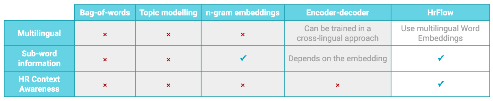

# Embedding

The ‘Profile & Job Embedding’ model analyzes the output of ‘Parsing’ and ‘Revealing’ layers and returns numerical vectors that represent a profile or job given as an input in a 512-dimensional space. 

The vector representation is computed by using the same HrFlow.ai technology used for ‘Scoring’ and ‘Reasoning’ layers. The vectors of similar profiles or jobs will be close to each other in the 512-dimensional space. The ‘Profile & Job Embedding’ model can be used for organizing to unleash endless uses cases. 

Now on, your AI experts Developers can focus on building great models instead of spending 90% of their time on pre-processing and vectorization.

| Embedding \(Vectors\) | Dimension |
| :--- | :--- |
| Profile2vec | 512 |
| Experience2vec | 512 |
| Education2vec | 512 |
| Skills2vec | 512 |
| Job2vec | 512 |

## Why you should choose **our Embedding ?**

### Features Workflow

* **Tokenization :** Our method of tokenization gives our models additional advantages in terms of making them less prone or prone to typing errors by leveraging  information on _**subwords**_ and _**multigrams**._
* **Vectorization** : Our vectorization method consists of a hierarchy of levels, a first one at the word level by using our in-house pre-trained _**word embeddings**_ on the world largest HR entities dataset, then a second one for _**encoding paragraphs**_ \(sections in documents\) based on Natural Language Processing state of the art models.

### **HrFlow.ai Vs Alternatives**

Document embedding is the operation that consists of representing a document by a dense fixed length vector.

| **Embedding** | _Bag-of-words_ | **Topic modelling** | n-gram embeddings | **Encoder-decoder** | HrFlow |
| :--- | :--- | :--- | :--- | :--- | :--- |
| Multilingual |        x  |        x  |        x  | Can be trained in a cross-lingual approach | Use multilingual Word Embeddings  |
| Sub-word information |        x  |        x  |       x | Depends on the world-level embedding used |       yes |
| HR Context Awareness |        x  |        x  |        x  |        x  |       yes |
|  |  |  |  |  |  |

