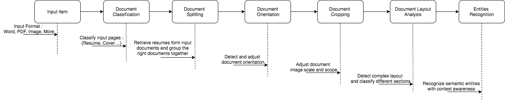
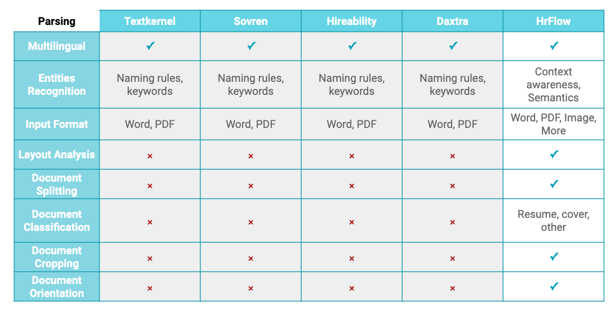

# Parsing API

### Profile API

We combined cutting edge Deep Computer Vision and Deep Natural Language Processing algorithms to allow you automatically extract semantic entities from raw and complex layout documents \(PDF, DOCX, IMAGES and more\) to get a structured json format.

| **Sections** | Attributes | Description | Example |
| :--- | :--- | :--- | :--- |
| info | First Name | First name | John |
| info | Last Name | Last name | Doe |
| info | Full Name | Full name | John Doe |
| info | Phone | Phone, mobile or fax number | \(+33\)612345678 |
| info | Location Text | Location address | 7 rue du Quatre Septembre, 75002 Paris, France |
| info | Location Latitude | Location latitude | 48.8705093 |
| info | Location Longitude | Location longitude | 2.3314779 |
| info | Email | Email address | contact@riminder.net |
| info | Date Birth | Date of birth | 26/11/1991 |
| info | Gender | Gender | male or female |
| info | Picture | Profile's public picture URL | https://myPicture.com |
| info | Driving License | Driving license | Permis B |
| info | Summary | Profile's summary | Data enthusiast |
| experience, education, info | Date Start | Starting date | 2016 |
| experience, education, info | Date End | Ending Date | 2020 |
| experience, education, info | Duration | Duration of a given experience or education | 5 months |
| experience, education, info | URL | Internet Link | https://www.hrflow.ai |
| experience | Company | Company Name | HrFlow.ai |
| experience | Title | Job title | Data Scientist |
| experience | Location Text | Location address | 2627 Hanover St, Palo Alto, CA 94304, United States |
| experience | Location Latitude | Location latitude | 37.4180666 |
| experience | Location Longitude | Location longitude | -122.1486833 |
| experience | Location Geocoder | Location geocoder info  | Geocoder Object |
| experience | Description | Description  | Solving unemployment with Deep Learning |
| experience | Date start | Date start | 2018-01-01T00:00:00 |
| experience | Date end | Date end | 2018-07-01T00:00:00 |
| experience | Certifications | Certifications owned in an experience | TOEIC - 750 |
| experience | Courses | Course taught in an experience | Big Data - Les fondamentaux |
| experience | Task | Assignment that have been given through an experience | Management of office supplies and consumables |
| experience | Skills | List of hard/soft skills | C++, Creativity |
| education | School | School or educational institution | Stanford University |
| education | Title | Degree | BSc Applied Mathematics |
| education | Location Text | Location address | 450 Serra Mall, Stanford, CA 94305, United States |
| education | Location Latitude | Location latitude | 11.1384724 |
| education | Location Longitude | Location longitude | -137.8396479 |
| education | Location Geocoder | Location geocoder info of the education | Geocoder Object |
| education | Description | Description | Upper second-class honors |
| education | Date start | Date start | 2016-01-01T00:00:00 |
| education | Date end | Date end | 2018-01-01T00:00:00 |
| education | Certifications | Certifications owned in an education | Machine Learning Professional Certificate |
| education | Courses | Course taught in an education | CS231n: Convolutional Neural Networks for Visual Recognition |
| education | Tasks | Tasks done in an education | Develop a Machine Learning model |
| education | Skills | List of hard/soft skills | Machine Learning, Leadership |
| certifications | Certifications | Certification associated to a skill or language | TOEIC - 750 |
| courses | Courses | Courses | CS231n: Convolutional Neural Networks for Visual Recognition |
| tasks | Tasks | Tasks | Develop a Machine Learning model |
| skills | Hard Skills | List of hard skills | Machine Learning, C++ |
| skills | Soft Skills | List of soft skills | Creativity, Leadership, Teamplayer |
| languages | Languages | List of languages | English, French, Chinese |
| interests | Interests | Centers of interest | Chess, Football, Cinema |


Parse a Reume here: [https://labs.hrflow.ai/profile-analytics/parsing](https://labs.hrflow.ai/profile-analytics/parsing) 


### Job API

In a more general case, here are the categories retrieved by our document parsing:

| Category | Description | Example |
| :--- | :--- | :--- |
| FirstName | First name | John |
| LastName | Last name | Doe |
| Phone | Phone, mobile or fax number | \(+33\)612345678 |
| Location | Geographic location or address | 7 rue du Quatre Septembre, 75002 Paris, France |
| Email | Email address | contact@riminder.net |
| Date | Any kind of dates in any formats | 26/11/1991; 4th of July |
| Certification | Administrative paper certifying a certain competency level for a skill | Permis B; TOEIC - 750 |
| Duration | Duration \(e.g. of an experience or an education\) | 5 months; 2 ans |
| Company | Company name | HrFlow.ai |
| JobTitle | Job name of position occupied | Data Scientist |
| Task | Assignment that represents an action to complete a given target | Management of office supplies and consumables |
| School | School or any educational institution | Stanford University |
| EduTitle | Title of a degree | BSc Applied Mathematics |
| Course | Name of a course taught in an education institution | CS231n: Convolutional Neural Networks for Visual Recognition |
| HardSkill | Technical attribute that enable someone to execute a task | Machine Learning; C++ |
| SoftSkill | Personal attribute that enable someone to interact effectively and harmoniously with other people | Rigorous; Teamplayer |
| Language | Language name | English, French, Chinese |
| Interest | Center of interest | Chess, Football, Cinema |
| URL | Internet link | https://www.hrflow.ai |


Parse a Reume here: [https://labs.hrflow.ai/job-analytics/parsing](https://labs.hrflow.ai/job-analytics/parsing) 


## Why you should choose our Parsing?

### Features workflow

### **HrFlow.ai Vs Alternatives**

