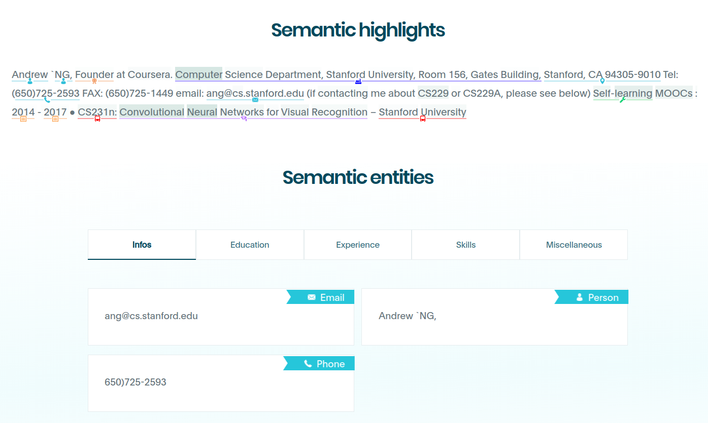

# Parsing

## Parsing Attributes

We combined cutting edge Deep Computer Vision and Deep Natural Language Processing algorithms to allow you automatically extract semantic entities from raw and complex layout documents \(PDF, DOCX, IMAGES and more\) to get a structured json format.

| **Sections** | Attributes |
| :--- | :--- |
| Info | First Name, Last Name |
| Info | Phone Number |
| Info | Location |
| Info | Email |
| Info | Birth date |
| Info | Driving Licence  |
| Experience | Start date, End date |
| Experience | Company |
| Experience | Job title |
| Experience | Location |
| Experience | Description |
| Education | Start date, End date |
| Education | School, Institution |
| Education | Degree, Title |
| Education | Location |
| Education | Description |
| Skills | Hard Skills |
| Skills | Soft Skills |
| Interests | Interests List |
| Languages | Languages List |

## Profile API


Generate your own augmented resume by trying: [https://labs.riminder.net/profile/augmented](https://labs.riminder.net/profile/augmented)


## Job API


Try our job offer parser:[ https://labs.riminder.net/profile/augmented](https://labs.riminder.net/jobs/semantic-analyzer/)


