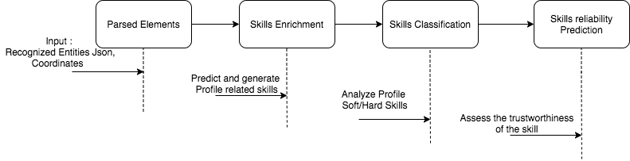
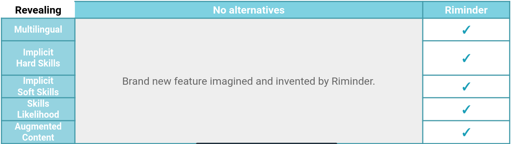

# Revealing

Get the full picture of your candidate’s real potential and derive insights from its career path. 

Based on our analysis of millions of profiles, our state of the art Natural Language Processing technology helps you not only mining the hidden skills related to a candidate profile or a job but also predicting their likelihood and relevance - so you don't judge only by words and what you see.

## Why you should choose our Revealing?

### Features workflow

### **HrFlow.ai Vs Alternative** 

