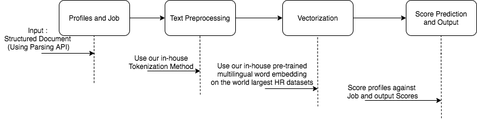
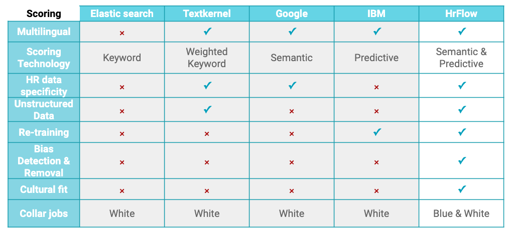

# Scoring API

Scoring technology helps you predict success and detect hidden gems. It allows you to score your profiles & jobs by relevance across all your pools. 

We developed a fair-by-design technology that leverages external benchmark, market best practices and internal knowledge about your company to help you build tailor-made and bias-free prediction models across all your jobs in any industry. These models are also getting smarter with every interaction and feedback.


## Why you should choose our Scoring?

### Features workflow




* **Tokenization :** Our method of tokenization gives our models additional advantages in terms of making them less prone or prone to typing errors by leveraging  information on _**subwords**_ and _**multigrams**._
* **Vectorization** : Our vectorization method consists of a hierarchy of levels, a first one at the word level by using our in-house pre-trained _**word embeddings**_ on the world largest HR entities dataset, then a second one for _**encoding paragraphs**_ \(sections in documents\) based on Natural Language Processing state of the art models.

### **HrFlow.ai Vs Alternatives**



## Training Data for Scoring

The scoring dataset plays a key role in the success of the scoring API retraining. Here are some requirements on its form and content.

### Format of the Training Data

The folder structure of a scoring training dataset must look like this:

```text
<dataset_dir>/
    ├── resumes/
    |    ├── 00.<resume_ext>
    |    ├── 00.json
    |    ├── 01.<resume_ext>
    |    ├── 01.json
    |    ├── ... 
    ├── jobs/
    |    ├── 00.json
    |    ├── 01.json
    |    ├── ...
    |   hiring_process.<ext>
    └── status.json
```

* the subfolder _resumes_ contains:
  * Resume in any supported extension \(pdf, docx, image and more\). They are save in the following format: &lt;resume\_id&gt;.&lt;resume\_ext&gt; 
  * Any relevant additional information \(metadata\) about the resume \(e.g. category of the resume if it has been categorized\), stored in JSON format as &lt;resume\_id&gt;.json
* the subfolder _jobs_ contains [job objects](https://developers.hrflow.ai/hr-json/job-objects/job-object) stored as JSON files
* The _hiring\_process.&lt;ext&gt;_  **fully describes the various statuses** of an application. Furthermore, a **diagram emphasizing how application statuses are linked to each other** is essential. 
* The _status.json_ links the relationship between the resumes and the job offers.  Given the following textbook case hiring process: screening -&gt; interview -&gt; hiring, the _status.json_ might look something similar to this_:_

```text
[
    {"job_id": "00", "resume_id": "00", "status": "screening"},
    {"job_id": "00", "resume_id": "01", "status": "discarded_after_screening"},
    {"job_id": "00", "resume_id": "02", "status": "interview"},
    {"job_id": "00", "resume_id": "03", "status": "discarded_after_interview"},
    {"job_id": "00", "resume_id": "04", "status": "hired"},
    ...
]
```

The first elements of this example shows five different applications to the same job offer \(id "00"\).  


### Quality of the Training Data

A particular attention must be paid to the statistical biases of the dataset. This issue originates from the overrepresentation of some category of data \(e.g. dataset containing mostly IT profiles, senior profiles, males over females, etc\).   
Without any safety precaution taken, a deep learning model naturally tends to inadvertently leverage biases to better fit the data.   
In order to successfuly retrain an unbiased scoring engine, the requirements are:

* Provide all the relevant side informations about the applicant in the _&lt;resume\_id&gt;.json_ files
* Provide all the relevant side informations about the jobs, they should be available in the job objects \(metadatas\)
* Provide enough diversity of data with regards to all the side informations available

In addition, in the scope of retraining a scoring engine, at least:

* 10k unique candidates
* 20k unique jobs
* 3k applications in hired status

are needed.

