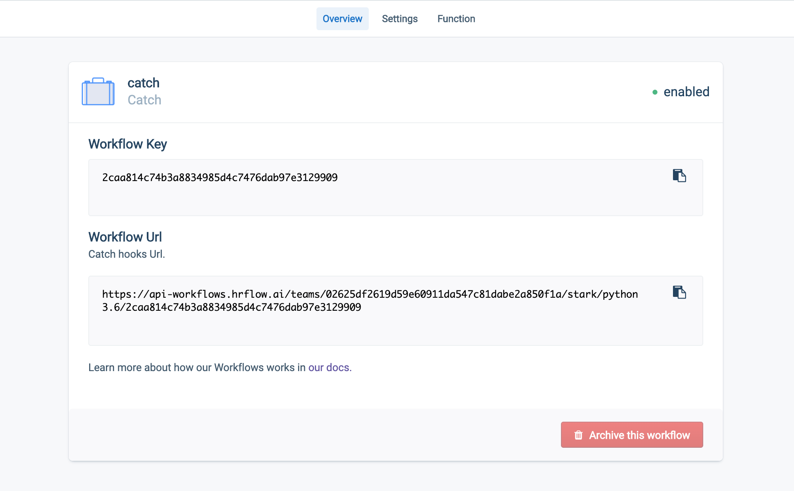

# Workflows & Automations

## Overview

The new HrFlow **Workflows** feature allows you to run your HR-related pipelines without ever worrying about servers. Whether you need to continuously run some routines or have a triggered execution both scenarios are possible with **Workflows**. \
\
Two main execution modes are available: _**Catch**_ and _**Pull**_. The _**Catch**_ mode is a _webhook-like_ setup that allows you to execute your code whenever a request is made to a precise endpoint. The **Pull** mode is similar to a _cron job_ which is executed at the rate of your choosing. In both modes, the code you submit **can leverage the `hrflow` sdk** to seamlessly create value with your HR data and HrFlow's **AI-Powered Job & Profile API**.&#x20;

## Workflow setup

**Workflows** is a _self-service_ that you can configure from the app by navigating to the dedicated section. If you click the top-right `Create Workflow`  button a new window lets you choose the kind of _workflow execution_ that you need.

Once created your workflow must be configured by clicking on it from the main **Workflows** section in the app.


Content below is valid for **Python3.6** runtime.&#x20;



For use cases that need to white list IPs you can add this IP **54.220.170.79** to properly integrate your workflows


### Catch setup

The core of your **Catch** workflow is the `Function`  section. To execute your code you are expected to write a function with this signature `def workflow(_request: Dict, settings: Dict) -> Union[None, Dict]`

Two arguments are available to your code in this mode :&#x20;

* `_request` is a dictionary containing the **parsed** _body_ and the _headers_ of the request that triggered the workflow execution. For example `_request["Content-Type"]`should give you the _Content Type_  of the request &#x20;
* `settings` is a dictionary containing data that you defined in the **Environment Properties** section. It can also be used as a way to store data that get persisted from one execution to another. Mind that both the key and value should **be natively JSON serializable**. For example, it won't work with `Python` `datetime.datetime.now()`

By leveraging the returned output of your function you can control the HTTP response sent back to the workflow caller. To do so simply return a **python dictionary** containing the following keys :&#x20;

* `status_code` **mandatory** `int`  : A valid HTTP status code returned as an `int` . **Mind** that a value such as `"200"` **won't work even if the conversion to integer is valid.**
* `body` **mandatory** `str` : The string body of the HTTP response
* `headers` **optional** `dict` : Dictionary with HTTP headers


**Mind** that if you return something other than a python dictionary the workflow execution **won't fail** but the HTTP response will have the default body


To illustrate let's consider this example where you process the event sent by some third-party service to add a new file to your HrFlow profile database. &#x20;

The main steps are :

* Setting up the `Hrflow` client with credentials stored in `settings`
* Parse the `_request` variable to retrieve relevant data
* Notify some other internal service that a new profile was added to HrFlow
* Inform the caller that the workflow executed properly and embed some data about the operation as a _JSON _response

```python
import json
import requests

from hrflow import Hrflow

def workflow(_request, settings):
    client = Hrflow(api_secret=settings["API_KEY"], api_user=settings["USER_EMAIL"])
    
    file_url = _request["file_url"]
    file_content = requests.get(file_url, allow_redirects=True).content
    
    client.profile.parsing.add_file(
        source_key=settings["SOURCE_KEY"]),
        profile_file=file_content,
        profile_content_type="application/pdf",
        reference="profile_reference"
    )
    
    id = requests.post(settings["OTHER_SERVICE_URL"], data={"key": "value"}).json()["id"]
    
    return dict(
        status_code=201,
        headers={"Content-Type": "application/json"},
        body=json.dumps({"id": id})
    )

```


For that code to execute correctly you must fill in the appropriate **environment properties** in the `Function` section of that particular **Catch** workflow.&#x20;

Once this is done you are all set! The **Catch** hook Url is ready to be used.



```bash

curl -X POST https://api-workflows.hrflow.ai/teams/XXX/YYY/python3.6/ZZZ \
    -H Content-Type:application/json \
    -d '{"file_url": "https://company.storage.fr/file/profile_1.doc"}'
```


**Important**: Only **POST** requests with one of the following three content types are accepted :&#x20;

* `application/json`
* `multipart/form-data`
* `application/x-www-form-urlencoded`


### Pull setup

The **Pull** setup is almost identical to the **Catch** one except for these two differences:

* The execution is not triggered by a request to some endpoint. The code is run continuously at the rate of your choosing
* Your function doesn't have access to a `_request` argument. The expected signature is shorter `def workflow(settings: Dict) -> None:`

Here is a workflow that uses a static endpoint to perform periodic fetching and storing of data in HrFlow. This example illustrates the storage capabilities of `settings`.&#x20;

```python
from hrflow import Hrflow

INTERNAL_ENDPOINT = "https://storage.company.com/records"

def workflow(settings):
    client = Hrflow(api_secret=settings["API_KEY"], api_user=settings["USER_EMAIL"])
    
    last_uid = settings["LAST_UID"]
    data = request.get("{}?last_uid={}".format(INTERNAL_ENDPOINT, last_uid)).json()
    for file_url in data["files"]:
        file_content = requests.get(file_url, allow_redirects=True).content
        
        client.profile.parsing.add_file(
            source_key=settings["SOURCE_KEY"]),
            profile_file=file_content,
            profile_content_type="application/pdf",
            reference="profile_reference"
        )
    
    # Update LAST_UID
    settings["LAST_UID"] = data["last_uid"]
```
