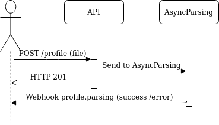
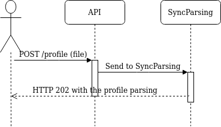

# \[POST\]  /profile/parsing/file

All possible extensions of a valid profile's resume are accepted \(.ie pdf, png, jpeg, docx, ppt, rtbf, html ...\)



Post /profile/parsing/file










Authentication token



User's email





Source key



Profile's file resume



Use sync parsing \(ie. 0 or 1\)



Index sync parsing results \(ie. 0 or 1\)



Receive webhook parsing success notification  
\(ie. 0 or 1\)



Document content type \(ie application/pdf\)



Profile's reference



Profile's label  
\(ie \[{"job\_key": "job\_key", "job\_reference": "test", "stage": "yes", "stage\_timestamp":1585662186, "rating":0.5, "stage\_timestamp":1585662186}, ...\]\)



Profile's tags  
\(ie \[{"name":"blacklist","value":true}, ...\]\)



Profile's metadata         
\(ie \[{"name":"mail","value":"test@test.com"}, ...\]\)



Reception date as iso format







Profile successfully Created using sync parsing.


```scheme
{
    "code": 201,
    "message": "Profile parsed successfully. Profile extraction finished : 7.279723644256592 seconds.",
    "data": {
        "parsing": {...},
        "profile": {...}
     }
}
```




Profile successfully Created using async parsing.


```scheme
{
    "code": 202,
    "message": "Your profile as been sent successfully to the Parsing Queue.",
    "data": []
}
```




Could not find a source matching this query.


```scheme
{
    "code": 400,
    "message": "Invalid source fields"
}
```




Invalid secret key.


```scheme
{
    "code": 401,
    "message": "Unauthorized. Invalid secret key: xxxx for permission: write"
}
```






While uploading a profile file you can use either **synchronous** or **asynchronous** parsing:

### **Asynchronous parsing:**

As explained in this diagram, parsing **** will be done **asynchronously** as soon as it is available. Then you will receive a webhook notification for success or failure of profile parsing.



**Synchronous parsing:**

For synchronous parsing , you will receive profile parsing in the response body.



**sync\_parsing** is an optional request parameter , you can set its value to 1 to use sync parsing or set its value to 0 to use async parsing.  
 The default behavior uses asynchronous parsing.  
  
So as to Use Sync Parsing, you need to:

* Create an API source \(HTTP / Python / PHP ...\),
* Enable SyncParsing for a given Source :
  * Your admin must activate SyncParsing  in source's configuration,
  * Send a request to HrFlow support team in order to enable this feature for you.
* Set sync\_parsing to 1 in your request

### What's a **profile\_id and how to retrieve it ?**

A profile ID is a unique identifier for a **HrFlow Profile**. This information is mandatory, **profile\_id guarantees the processing** of your profile \(parsing, revealing, embedding, etc\).

**How to get a profile id**

If you are using SyncParsing you will receive profile\_id in response's body  and if you are using the AsyncParsing you have 3 possible ways that help you retrieve this information.

* Upload your document with a profile\_reference, thus you can get profile's parsing from [this endpoint](https://developers.hrflow.ai/api-reference/profile-api/get-profile-parsing) using source\_id and profile\_reference,
* Set up a webhook that listens to all incoming notifications from HrFlow. As soon as your document is well parsed you will receive a success event including  the profile id,
* Use HrFlow's Profile Search Engine, in order to find profile's details, then you can fetch for profile\_id.

### Example



```php
$client = new Hrflow\Client('your api key');

$data = [
  'timestamp_reception'   => 1569320033,  
  'profile_content_type'  => 'application/pdf', 
  'profile_reference'     => 'profile_reference', 
  'profile_labels'        =>  [
    [
      'job_id'           => 'job_id',
      'stage'            => 'yes',
      'stage_timestamp'  => 1585662186,
      'rating'           => 0.5,
      'stage_timestamp'  => 1585662186
    ], 
    ...
  ],
  'profile_metadatas' => [["name" => "mail", "value" => "test@test.com"], ...],
]
$profile_file = fopen('/path/to/file.pdf','rb');

$client->profile::addFile($source_id, $profile_file, $data);
```



```python
import hrflow as hf

client = hf.client(api_secret='your api secret')

with open('/path/to/file.pdf','rb') as file:
    profile_file = file.read()
    
client.profile.add_file(source_id="source_id",
                        profile_file=profile_binary,
                        profile_content_type='application/pdf',
                        profile_labels=[]
                        profile_tags=[{"name" : "email", "value": "test@hrflow.ai"},
                                      {"name" : "blacklist", "value": True}],
                        profile_metadata=[],
                        timestamp_reception=1587398379
                        sync_parsing=0)
```



```javascript
import * as fs from "fs";
import Hrflow from 'hrflow';
const client = new Hrflow({
    api_secret: "Your API Key",
    api_user: "Your API user email",
});

const data = {
  source_key: "source_key",
  file: fs.createReadStream("path to your file"),
  created_at: 1569320033,
  metadatas: [{"name":"mail","value":"test@test.com"}, ...],
  profile_content_type: 'application/pdf', 
  profile_reference: 'profile_reference',
  labels:  [
    {
      "job_key": "job_key",
      "job_reference": "test",
      "stage": "yes",
      "stage_timestamp":1585662186,
      "rating":0.5,
      "stage_timestamp":1585662186
    }, 
    ...
  ],
  tags:  [{"name":"blacklist","value":true}],
  sync_parsing: 1,
}

client.profile.addFile(data);
```




