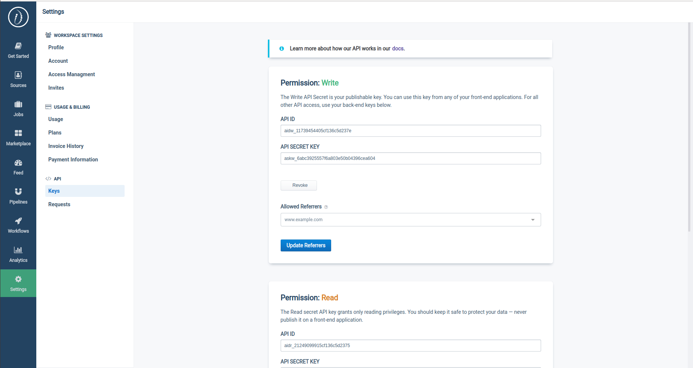

# API Authentication

## Accessing your API Keys

After creating your account our system will automatically generate for you three pairs of :

* **Client Id**
* **Client Secret Key** \(you have to store it safely\)

These keys will be available with various level of permissions:

| **Permissions** |  |
| :---: | :---: |
| WRITE | Send data \(can be used front-end side\) |
| READ |  Retrieve data \(only server side\) |
| READ & WRITE | All permissions  |

You can find your API credentials by clicking the `API > Keys`  tab in your setting section.



## Using your Key

Requests are authenticated using a `HTTP` header called `X-API-Key`. Pass your API Secret Key \(ex: `DEMO_KEY`\) into the `X-API-Key` header. You do not need to provide an auth username or a password.

```bash
curl endpoint_url -H "X-API-Key: DEMO_KEY"
```

To accept API calls only from an approved list of domains, you should choose a `Write Only` permission and specify a  `DOMAIN WHITELIST` .

