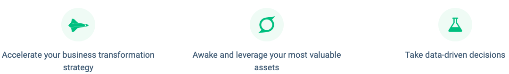
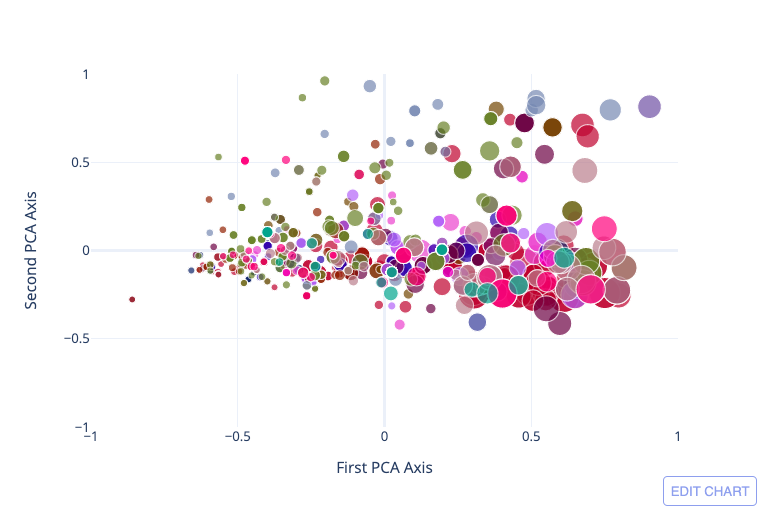

# Analytics API

The Analytics API provide deep qualitative insights about career moves, academic and professional skills gap, market landscape and more, based on the analysis of external and internal profile and job data.

You can connect Analytics API to other external tools, like Tableau, Kibana, Plotly, etc. and generate comprehensive insights about your data.

