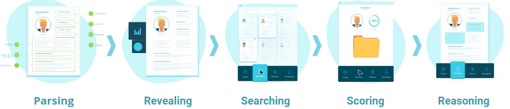

# Profile API

The Profile API helps you connect HrFlow.ai with the applications of your choice. Mainly, the API allows you to POST profiles and GET outbound data after the processing of choice is done.

The six processing layers available for the Profile API are: [Parsing](../ai-layers/parsing.md), [Embedding](../ai-layers/embedding.md), [Revealing](../ai-layers/revealing.md), [Searching](../ai-layers/searching.md), [Scoring](../ai-layers/scoring.md) and [Reasoning](../ai-layers/reasoning.md).

