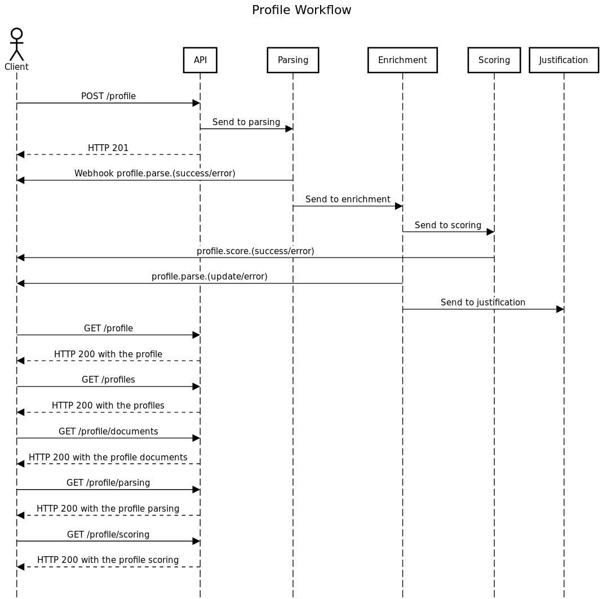
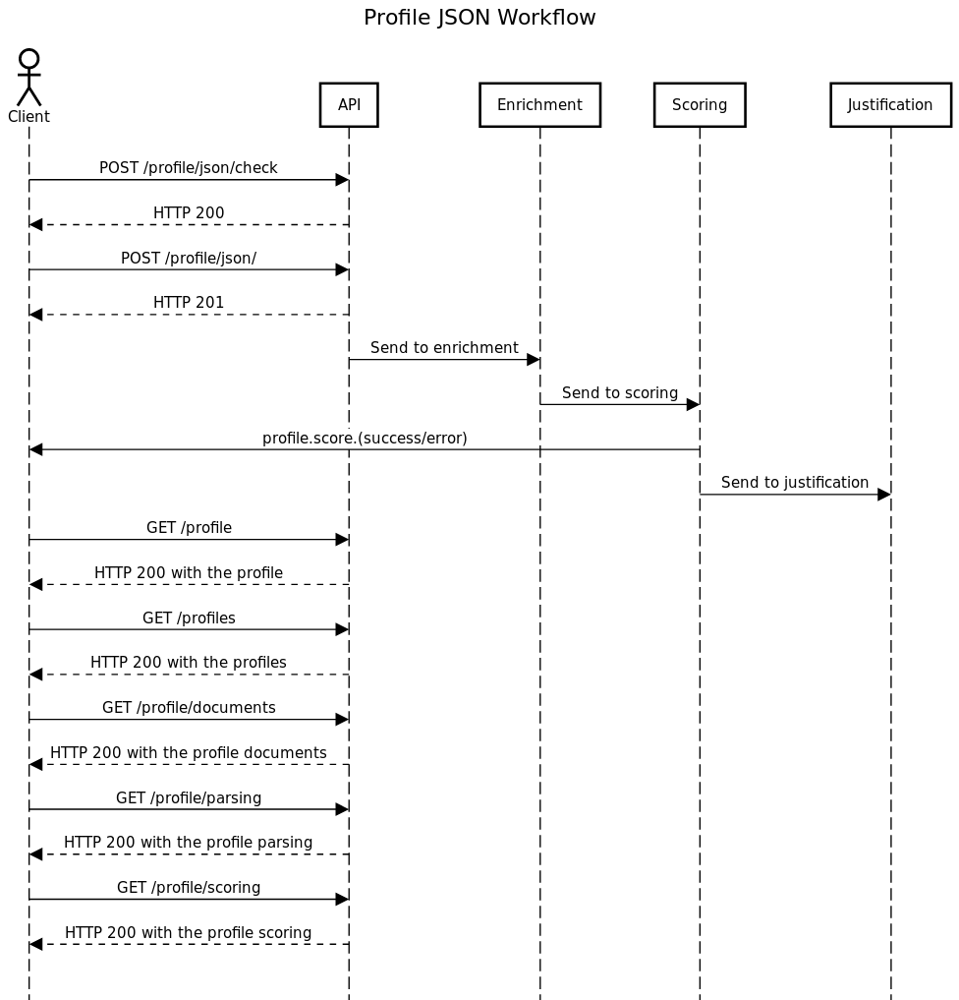
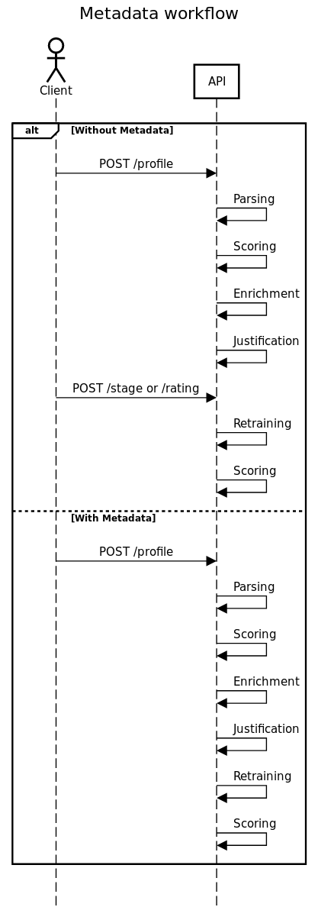
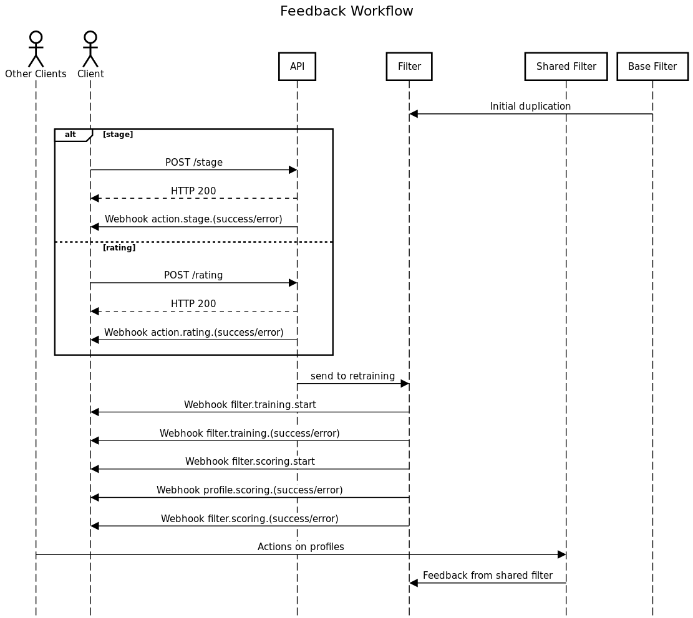

# Use case of the API

Using the API is very simple. The following diagrams explain in which order you should perform actions to get the best possible experience.

## Basic usage

First of all, the following diagram explains the basic use case of the API : uploading profiles and getting information back from the platform.

First, you need to post a profile. Then, when the parsing and the scoring are done, you can retrieve the profile and every item associated such as the documents or the parsing's result. As you can see, we use webhooks for each operation. These webhooks contain everything you need to track about what is happening on the platform.

## Advanced usage

### Parsed profile

Alternatively, if you have the parsed version of a profile, you can upload it to the platform to score the profile. The process is quite similar and summed up in the following diagram

### Using metadata

Your Filters are not static. They improve themselves as you use the platform. There are currently two ways to give a feedback on the uploaded profile.

* By giving ratings and tagging profiles as Go/No Go/Later, directly on the platform. These are actions you can perform after uploading a profile.
* By combining ratings and tags directly when you upload a profile. The following diagram shows the two alternatives.

### Feedback

Actually, it's not only your choices and actions that makes Filters evolve. Every client, through its interactions with HrFlow, has an impact on shared Filters. These Filters are the results of what we've analyzed from the current job market trends, and influences your personal Filters.  
The following diagram should help you to understand how everything works.

