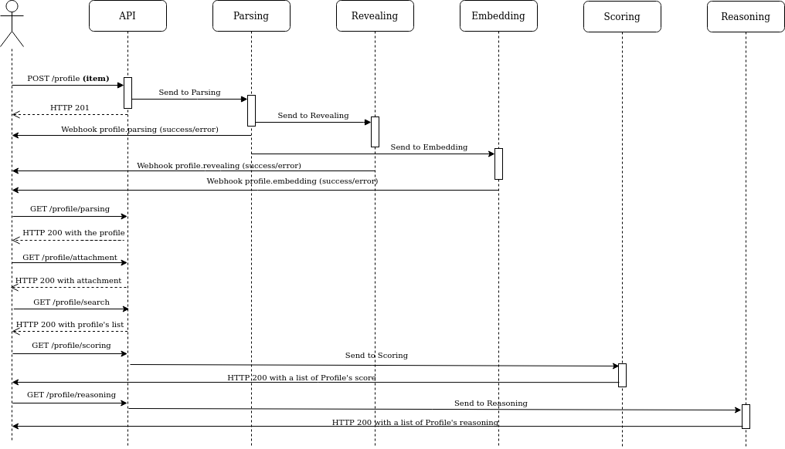

# Using HrFlow.ai

Using the API is very simple. The following diagrams explain in which order you should perform actions to get the best possible experience.

## Basic usage

First of all, the following diagram explains the basic use case of the API : uploading profiles and getting information back from the platform.

