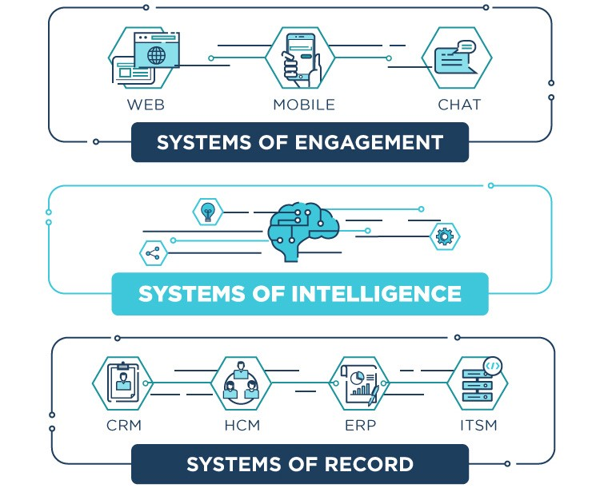
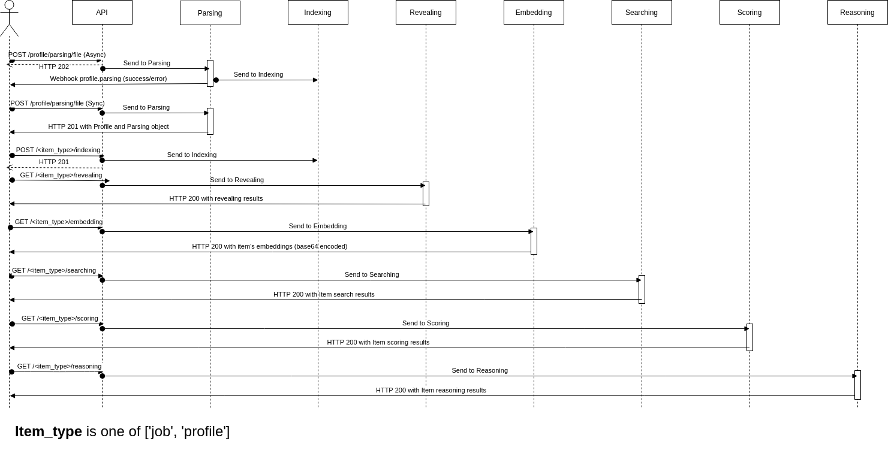

# What does HrFlow.ai?

## System of Intelligence

[HrFlow.ai](http://HrFlow.ai) is a system of intelligence that operates as an AI layer bridging the gap between your systems of engagement and systems of record. We allow our users to get the most of our technology seamlessly without changing the end user behavior.

## Processing Flow

First of all, the following diagram explains the basic use case of the API : uploading profiles and getting information back from the platform.

## Building with HrFlow.ai

Building with Hrflow.ai is very simple. The following diagram give details about our architecture and how you can get the best possible experience.

